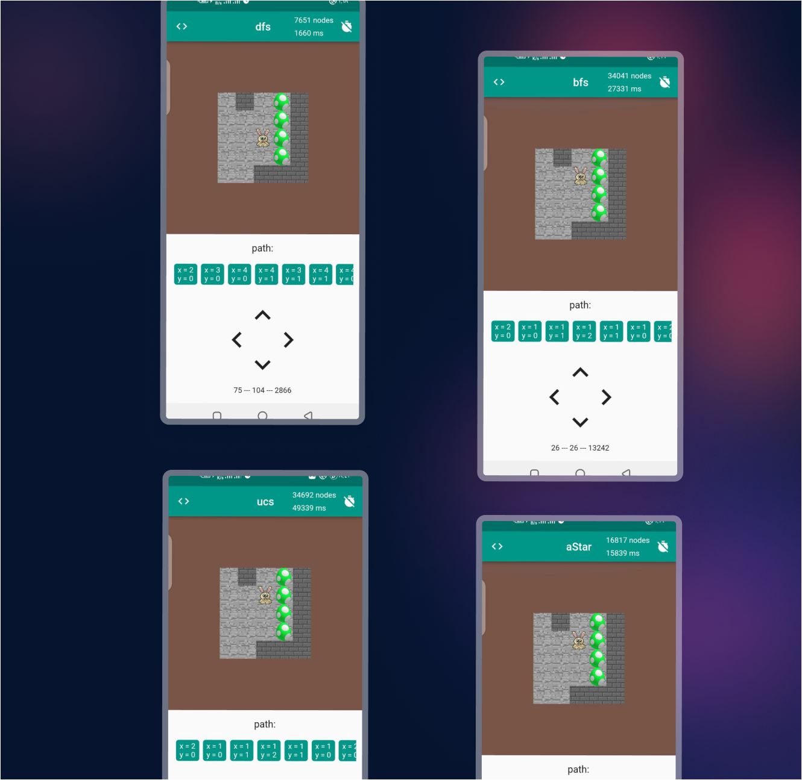

# :sparkles::sparkles: Sokoban Game
Sokoban is a classic puzzle video game that originated in Japan in the early 1980s. The name "Sokoban" translates to "warehouse keeper" in Japanese, which perfectly describes the role the player assumes in the game.
